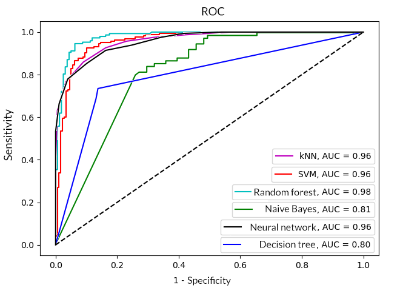

Master’s final project, fall detector for elderly based on Panasonic Grid-EYE thermal camera, artificial intelligence 
algorithms and Raspberry Pi at the edge of the AWS cloud. This project consists of following functionalities:

* Thermal images capture and analyse,
* Elderly fall detection on the basis of artificial intelligence algorithms,
* Notifications sending to patient’s supervisors,
* Saving and browsing recorded falls within AWS cloud.

## Table of Contents
- [Hardware](#hardware)
- [Cloud architecture](#cloud-architecture)
- [Dataset collection](#dataset-collection)
- [Artificial intelligence algorithms](#artificial-intelligence-algorithms)
- [Results and conclusions](#results-and-conclusions)

## Hardware
Project is based on Raspberry Pi with 3B+ version but previous models within B series are supported as well. To take a 
thermal image the AMG8833 thermal camera with Panasonic Grid-EYE chip on the board is used. This sensor is an 8x8 array
of IR thermal sensors. When connected to Raspberry Pi it will return an array of 64 individual infrared temperature 
readings over I2C interface. This module measures temperatures ranging from 0 °C to 80 °C (32 °F to 176 °F) with an 
accuracy of +- 2.5°C (4.5°F). It can detect a human from a distance of up to 7 meters (23 feet). With a maximum frame 
rate of 10Hz, it meets the requirements for creating human detector or mini thermal camera.

## Cloud architecture
In order to implement a cloud-based system to handle the elderly falls, the AWS cloud platform was used with serverless 
approach. With serverless computing, infrastructure management tasks like capacity provisioning and patching are handled 
by AWS. Serverless services come with automatic scaling, built-in high availability, and a pay-for-value billing model. 
Below figure represents used cloud architecture.

## Dataset collection
In order to build up high accuracy detector model it is necessary to create reliable training dataset. In this project 
all training samples are actual fall records. After many bruises and countless painful hours (in the name of science :) ) 
the final training dataset consists of 250 record – 125 of actual falls and 125 of ordinary activities (walking, 
sitting, crouching etc.). Each record is set of 8 frames in 8x8 resolution captured using 8Hz frequency (FPS). Above 
parameters are determined experimentally and gave the best results. An example record is show on figure below (with 
interpolation to 24x24 resolution on the left and in original size on the right).

## Artificial intelligence algorithms
To create fall detection model, following algorithms were used:
* Neural Network (TensorFlow)
* SVM (Support Vector Machine)
* Random Forest
* Decision Tree
* K Nearest Neighbours (knn)
* Naive Bayes

## Results and conclusions
The best results were achieved for configuration using 8Hz and 8x8 frame resolution. Quality measures were determined 
for each model created. Based on the obtained measures, it can be concluded that the SVM algorithm and the random forest 
algorithm allow the best solution to the problem of classifying the fall of an elderly person using a thermal camera.

|             | Random forest | SVM    | Neural Network | kNN    | Decision tree | Naive Bayes |
|-------------|---------------|--------|----------------|--------|---------------|-------------|
| Precision   | 0,94          |  0,92  | 0,91           |  0,91  | 0,80          | 0,79        |
| Sensitivity | 0,94          |  0,92  | 0,91           |  0,89  | 0,81          | 0,78        |
| Specificity | 0,93          |  0,91  | 0,89           |  0,91  | 0,79          | 0,80        |
| F1 score    | 0,93          |  0,91  | 0,89           |  0,90  | 0,80          | 0,79        |
| MCC         | 0,87          |  0,83  | 0,79           |  0,82  | 0,52          | 0,58        |

Moreover, the determined ROC curves presented in figure below confirm the above conclusions. The largest area under the 
graph was achieved for the SVM algorithm and the random forest, while the smallest for the Bayesian classifier and 
decision trees. Noteworthy are also neural networks and the kNN algorithm, which also correctly solve the problem of 
falling classification, achieving a detection efficiency of about 90%.

Full master thesis in Polish language may be found [here](./_example/Master_thesis-Lukasz_Blasiak.pdf).